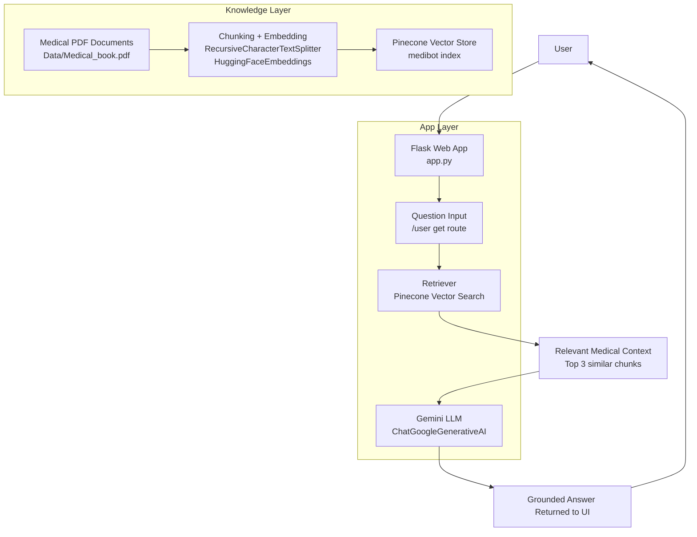

# Medical Chatbot

Medical Chatbot is an AI-powered medical question-answering application that helps users ask questions about medical content and receive grounded answers based on a curated knowledge base. It uses a Retrieval-Augmented Generation (RAG) pipeline to search relevant medical information from PDFs, retrieve the most relevant passages, and generate concise, context-aware responses through a large language model.

## What the application is about

This project is designed to act as a healthcare information assistant for medical study material and reference documents. Instead of relying only on the model's general knowledge, the app first loads medical PDFs, splits them into smaller chunks, converts them into vector embeddings, and stores them in a vector database. When a user asks a question, the system retrieves the most relevant passages from that database and sends them to a generative AI model to produce a grounded answer.

This makes it useful for:
- Medical readers and students who want quick explanations from a reference PDF
- Knowledge retrieval from healthcare and clinical documents
- Building a lightweight RAG-based chatbot without a full enterprise system
- Prototyping AI assistants for domain-specific question answering

Important: This application is intended for informational support and educational use. It should not replace a licensed medical professional or be used as a substitute for diagnosis or treatment advice.

## Architecture overview



## How the system works

1. Medical documents are loaded from the `Data/` directory using a PDF loader.
2. The extracted text is split into smaller chunks for better retrieval.
3. Each chunk is converted into vector embeddings using a Hugging Face sentence-transformer model.
4. The embeddings are stored in Pinecone, which acts as the vector database for semantic search.
5. When a user submits a question, the app queries Pinecone for the most relevant document chunks.
6. The retrieved context is sent to Google Gemini together with the user's prompt.
7. The model generates a concise answer grounded in the retrieved medical content and returns it to the web interface.

## Tech stack

- Python
- Flask for the web application
- LangChain for orchestration and RAG workflow
- Hugging Face embeddings for semantic embedding generation
- Pinecone for vector search and similarity matching
- Google Generative AI (Gemini) for answer generation
- PyPDF / LangChain document loaders for PDF processing

## Repository structure

```text
Medical-Chatbot/
├── app.py                     # Flask app and RAG pipeline setup
├── template.py                # Template helper file
├── requirements.txt           # Project dependencies
├── setup.py                   # Package metadata
├── README.md                  # Project documentation
├── Data/
│   └── Medical_book.pdf       # Source medical knowledge base
├── src/
│   ├── helper.py              # PDF loading, embeddings, text splitting
│   ├── prompt.py              # System prompt used by the LLM
│   ├── store_index.py         # Script for indexing document chunks in Pinecone
│   └── __init__.py
├── static/
│   └── style.css              # Front-end styling
├── templates/
│   └── chat.html              # Chat UI
├── research/
│   └── trials.ipynb           # Experiments / notebook trials
├── .gitignore
├── LICENSE
└── .env                       # Local environment variables (not committed)
```

## Setup instructions

1. Clone the repository
2. Create a virtual environment and activate it
3. Install dependencies

```bash
pip install -r requirements.txt
```

4. Create a `.env` file with your API keys:

```env
PINECONE_API_KEY=your_pinecone_api_key
GOOGLE_API_KEY=your_google_api_key
```

5. Run the app:

```bash
python app.py
```

6. Open the app in your browser at:

```text
http://localhost:8080
```

## Example workflow

- User enters: "What is the role of insulin in diabetes?"
- App retrieves top relevant chunks from the medical PDF stored in Pinecone
- Gemini uses that context to generate an answer
- Response is shown in the chatbot interface

## Notes

- This project is a strong example of a domain-specific RAG application.
- It demonstrates how vector databases, LLMs, and retrieval pipelines can be combined to create a knowledge-grounded chatbot.
- It can be extended with more documents, better chunking strategies, a proper database, authentication, or a production deployment setup.

## License

This project is licensed under the MIT License. See the `LICENSE` file for details.
